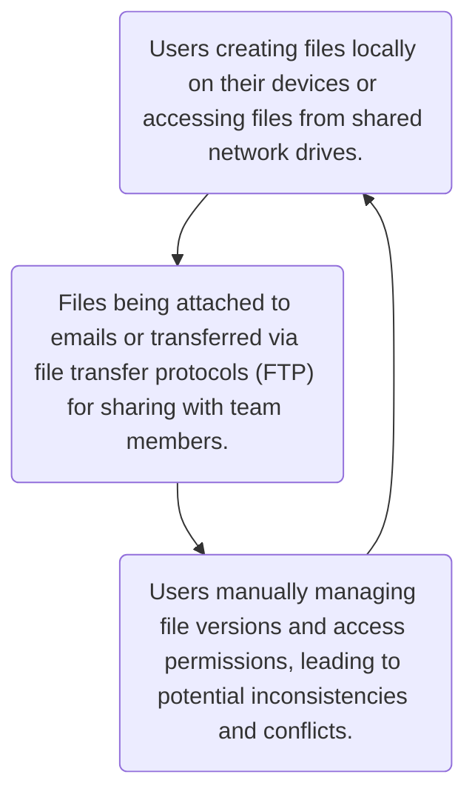

Requirement Specification: Cloud-Based File Sharing Platform
============================================================

Overview
--------

Our organization is in need of a modern and efficient cloud-based file sharing platform to streamline our file management processes and enhance collaboration among team members. The platform should provide secure and convenient access to files from any location or device with internet connectivity.

Current Situation
-----------------

Currently, our organization relies on traditional file storage methods, such as local servers and email attachments, for sharing and accessing files. However, these methods are often cumbersome, leading to inefficiencies, version control issues, and difficulty in accessing files remotely.

Objectives
----------

*   Implement a cloud-based file sharing platform to improve productivity and collaboration within the organization.
    
*   Enable seamless file access from any location or device, ensuring flexibility and convenience for users.
    
*   Enhance data security and privacy through robust authentication, access control, and encryption mechanisms.
    
*   Streamline file management processes, including uploading, sharing, and organizing files, to reduce manual effort and errors.
    

Model of Current Business Processes
-----------------------------------

Currently, our organization follows manual file sharing processes, which involve:

Model of Demanded Business Processes
------------------------------------

The demanded business processes for the new cloud-based file sharing platform include:

1.  Users uploading files to the platform's cloud storage through a user-friendly web interface or desktop application.
    
2.  Files being securely stored in the cloud and accessible to authorized users based on predefined access permissions.
    
3.  Users sharing files with team members through secure sharing links or direct invitations, with configurable access levels (e.g., view-only, edit).
    
4.  Real-time synchronization of files across devices, ensuring users have access to the latest versions of documents.
    
5.  Administrators managing user accounts, access permissions, and system settings through an administrative dashboard.
    
Request List
------------

1.  **User Authentication and Authorization**:
    
    *   Implement secure user authentication mechanisms, including password-based login and multi-factor authentication (MFA).
        
    *   Enable role-based access control to differentiate between administrators and regular users.
        
2.  **File Management**:
    
    *   Develop functionalities for uploading, downloading, and organizing files within user libraries.
        
    *   Ensure efficient storage and retrieval of files in the cloud, with support for various file formats and sizes.
        
3.  **Access Control**:
    
    *   Enable users to set access permissions for shared files, including read-only and read-write access.
        
    *   Implement encryption mechanisms to protect files during transmission and storage.
        
4.  **File Sharing**:
    
    *   Allow users to share files with team members through secure sharing links or direct invitations.
        
    *   Provide options for configuring access levels and expiration dates for shared links.
        
5.  **User Profile Management**:
    
    *   Enable users to customize their profiles, update personal information, and manage account settings.
        
    *   Implement password reset and email verification functionalities for account security.
    
Glossary
--------

*   **Administrator**: A user with elevated privileges who can manage user accounts, access permissions, and system settings.
    
*   **User**: A regular user of the platform who can upload, share, and access files based on assigned permissions.
    
*   **Access Permissions**: Permissions granted to users for accessing and interacting with files, including read, write, and delete actions.
    
*   **Cloud Storage**: Remote storage infrastructure hosted by a third-party provider, accessible over the internet for storing and accessing files.
    
*   **Encryption**: The process of encoding data to protect it from unauthorized access or tampering, often used for securing files during transmission and storage.
